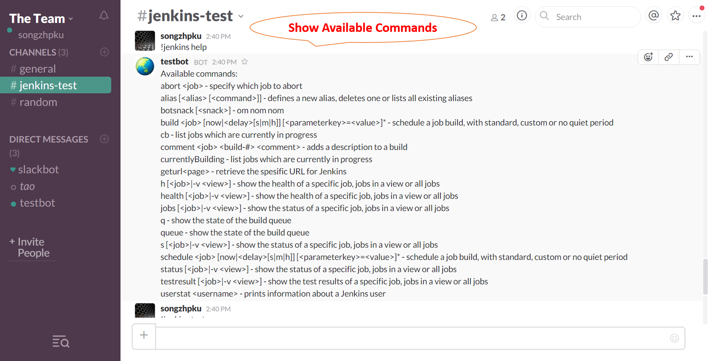
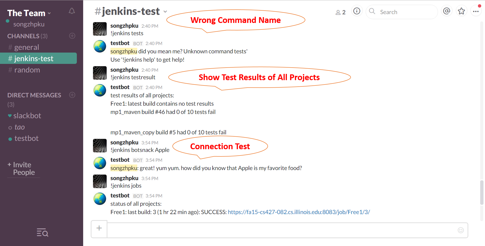
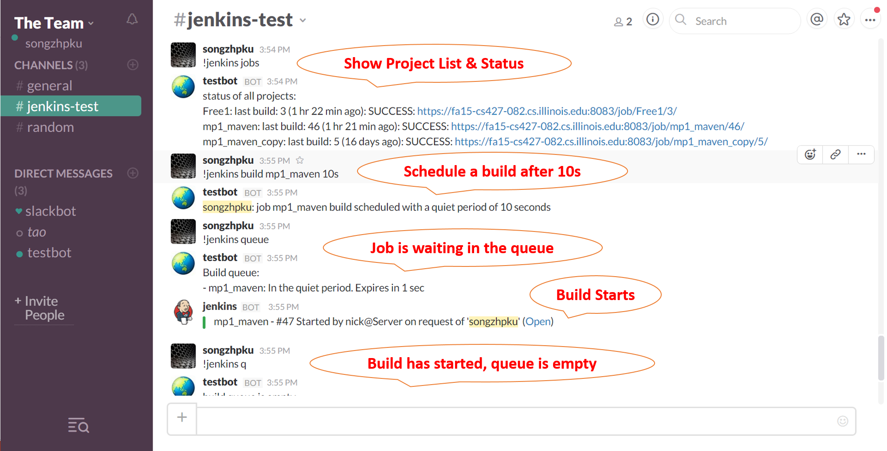
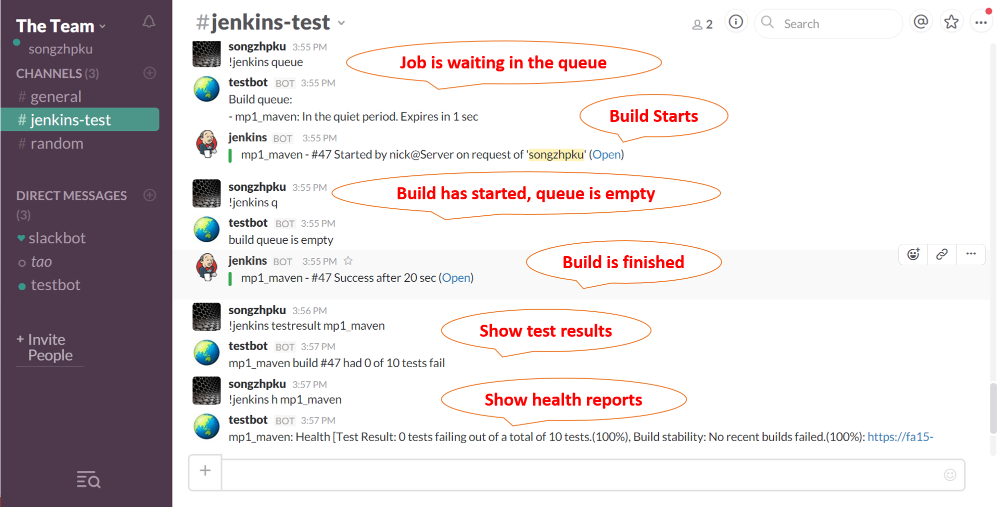
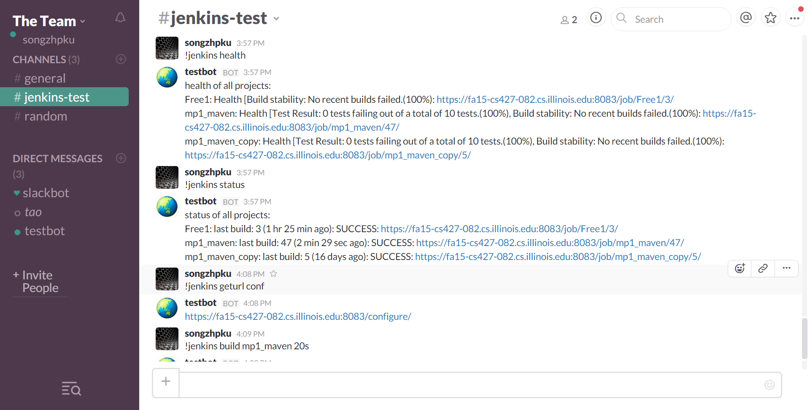
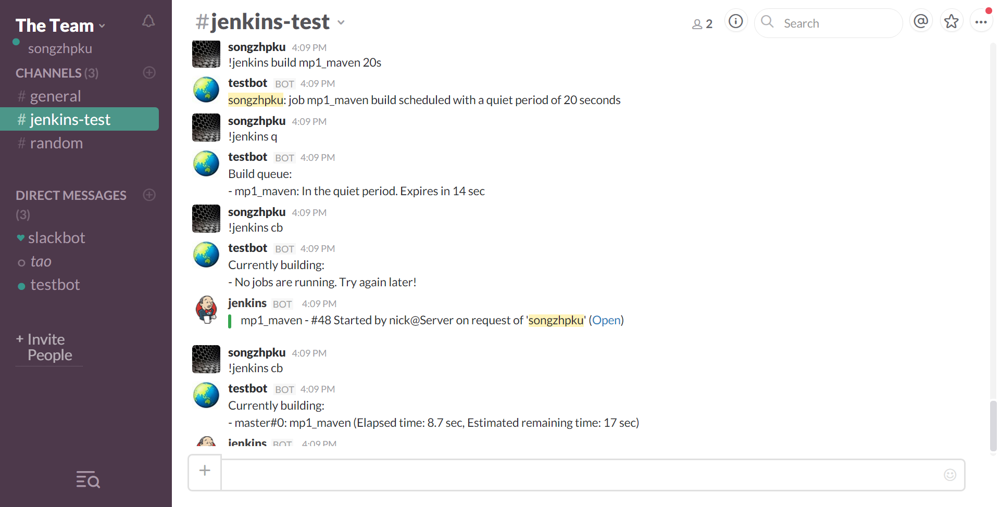

### Introduction

The main goal of this project is to provide a smart bot, which enables the direct communication between [Jenkins](https://jenkins-ci.org/) and [Slack Channel](https://slack.com/). Users can interact with Jenkins and control various features of jobs by directly sending commands within a Slack Channel.

### Implementations

The project is consist of two independent Java implementations.

- Jenkins Plugin
    
    The bot is running inside Jenkins as a plugin, which is built on top of [Slack plugin for Jenkins](https://github.com/jenkinsci/slack-plugin) and [Instant Messaging Plugin](https://wiki.jenkins-ci.org/display/JENKINS/Instant+Messaging+Plugin). The manager of Jenkins server must install the plugin to activate the bot.

- Remote SlackBot
    
    The bot can run independently of both Jenkins and Slack. The interaction of Jenkins is implemented via [Remote Access API](https://wiki.jenkins-ci.org/display/JENKINS/Remote+access+API). **--- Under Construction ---**

### Installation Guide

- Jenkins Plugin
    1. Install the slack plugin inside Jenkins. Please contact the Jenkins server managers for help.
    2. Create a [Programming Slackbot](https://slack.zendesk.com/hc/en-us/articles/202026038-Slackbot-your-assistant-notepad-programmable-bot) and record the global unique token.
    3. Go to "Mange Jenkins" -> "Configure System", find the "Global Slack Bot Setting" section.
        
        

    4. Type in SlackBot token provided by Slack. 
    5. If the Jenkins is protected, a valid Jenkins user Id must be provided, otherwise most commnands won't work. You can also use this to restrict which commands can be executed via the bot, by removing the respective permissions for this user.
    6. Save
    7. Go to your Slack channel and try "!jenkins botsnack apple"
        
        

    8. "!jenkins help" command will always provide the full list of available commands. 

        

- Remote SlackBot
    
    To be Finished

### Usage Demo

### Supported Commands
####Schedule a job build, with standard, custom or no quiet period
    build <job> [now|<delay>[s|m|h]] [<parameterkey>=<value>]* 
    schedule <job> [now|<delay>[s|m|h]] [<parameterkey>=<value>]* 
####Specify which job to abort
    abort <job>
####Adds a description to a build
    comment <job> <build-#> <comment>

---
####List jobs which are currently in progress
    cb 
    currentlyBuilding 
####Show the health of a specific job, jobs in a view or all jobs
    h [<job>|-v <view>]
    health [<job>|-v <view>]
####Show the status of a specific job, jobs in a view or all jobs
    jobs [<job>|-v <view>] 
    s [<job>|-v <view>]
    status [<job>|-v <view>]
####Show the state of the build queue
    q
    queue
####Show the test results of a specific job, jobs in a view or all jobs
    testresult [<job>|-v <view>]
####Prints information about a Jenkins user
    userstat <username> 

---
####Defines a new alias, deletes one or lists all existing aliases
    alias [<alias> [<command>]] 
####Connection Test
    botsnack [<snack>]